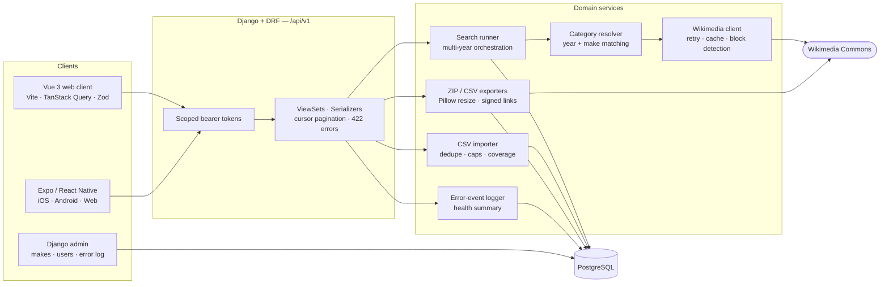

# Cars Images API — Django

A **Django + Django REST Framework** platform that searches, filters, reviews, and bulk-exports car photography from **Wikimedia Commons** — one vehicle at a time, or thousands of rows from a CSV — with a **Vue 3** web client and a **React Native (Expo)** mobile client on the same versioned `/api/v1` JSON API.


> **Status:** feature-complete port, deployed on free tiers. Changes are tracked in [CHANGELOG.md](CHANGELOG.md).
>
> **Live demo**
>
> | App | URL |
> |---|---|
> | Vue web client | <https://cars-images-django-web.netlify.app> |
> | Expo client (web build) | <https://cars-images-django-mobile.netlify.app> |
> | Django API · admin | <https://cars-images-api.onrender.com/api/v1> · <https://cars-images-api.onrender.com/admin/> |
>
> The API runs on a free instance, so the first request after it has been idle can take about a minute.

---

## Contents

- [Overview](#overview)
- [Architecture](#architecture)
- [Features](#features)
- [JSON API](#json-api)
- [Clients](#clients)
- [Engineering decisions](#engineering-decisions)
- [Tech stack](#tech-stack)
- [Getting started](#getting-started)
- [Configuration](#configuration)
- [Testing](#testing)
- [Deployment](#deployment)
- [Project structure](#project-structure)
- [Milestones](#milestones)
- [Roadmap](#roadmap)

---

## Overview

Sourcing usable photos for a large vehicle catalogue is tedious: every make/model/year needs its own search, Wikimedia's full-text index is inconsistent, results are often mis-filed or not cars at all, and the originals are far too large to ship to a website.

This platform turns that into a reviewable pipeline:

1. **Import** a vehicle list (CSV) or run a single ad-hoc search.
2. **Harvest** images from Wikimedia Commons at a rate the API accepts.
3. **Review** what came back — off-target results are flagged, never silently trusted.
4. **Export** the approved set as a web-optimised ZIP plus a matching CSV manifest.

Every stage is inspectable from the Django admin, the Vue web client, or the Expo mobile app.

This project is a full-stack port of an existing Laravel 13 + Filament + Expo system. The mobile client runs **unchanged** against the Django API: the API honours the exact JSON contract the app validates with Zod, and shared JSON fixtures keep both sides honest.

---

## Architecture



---

## Features

### Search
- Search by **make, model, year range, colour, and transmission**, fetched **one year at a time**.
- **Commons category resolution** — model names are normalised (engine sizes and drivetrain qualifiers like `AWD`, `xDrive`, `Hatchback` stripped) and tried longest-first; hits are cached permanently, misses expire.
- **Exact-year filtering** — an image is kept only when its title names that model year next to the make; photo dates and year ranges are ignored.
- **Make confirmation** — each image is flagged *Confirmed* or *Not confirmed* from its title, description, and categories.
- **Deduplication** — an identical completed search is reused instead of hitting Wikimedia again.

### CSV pipeline
- Upload a `Make, Model, Year[, Transmission]` CSV; rows are validated, deduplicated, and turned into queued searches.
- Guard rails on **unique query count** and **projected image count**, not just file size.
- **Coverage report** per import: total, searched, not run, failed, with images, no images.
- **Chunked bulk runs** with pause/resume, progress, and automatic stop when Wikimedia rate-limits.

### Review & export
- Human review workflow: `pending → approved / rejected`, recording reviewer and time.
- **ZIP export** of up to 100 images, resized to 1600 px JPEG; filenames like `2021 Toyota Corolla 2.jpg`.
- **CSV manifest** whose filenames match the ZIP entries exactly.
- Exports are delivered through **short-lived, single-use signed links**.

### Observability
- Structured **error-event log** (CSV upload, CSV row, search run, image download, Wikimedia block) with size-clamped messages and a per-import cap.
- **Health summary**: searches by status, errors in 24 h, errors by context over 7 days, images collected.
- **Admin dashboard** — health stats with a 7-day sparkline, failures by kind (14 days), search throughput
  (30 days) and the ten latest failures, drawn as inline SVG with no charting library.
- `prune_error_events` management command with configurable retention.

---

## JSON API

All endpoints live under `/api/v1`, require `Authorization: Bearer <token>` (except login), and return JSON.

| Method | Path | Ability | Purpose |
|---|---|---|---|
| `POST` | `/auth/login` | — | Issue a scoped token (5/min) |
| `POST` | `/auth/logout` | any | Revoke the current token |
| `GET` | `/auth/me` | any | Current user |
| `GET` | `/images` | `search:read` | Filterable, cursor-paginated image list |
| `GET` | `/images/count` | `search:read` | Count for the same filters |
| `GET` | `/images/{id}` | `search:read` | Image detail |
| `PATCH` | `/images/{id}/review` | `review:write` | Approve / reject / reset |
| `GET` | `/searches` | `search:read` | Filter by status, source, import, coverage |
| `GET` | `/searches/{id}` | `search:read` | Search detail |
| `GET` | `/searches/{id}/images` | `search:read` | Images for a search |
| `POST` | `/searches` | `search:write` | Run an ad-hoc search (10/min) |
| `POST` | `/searches/run-chunk` | `search:run` | Run the next chunk of a CSV import |
| `GET` | `/imports` | `imports:read` | CSV imports |
| `GET` | `/imports/{id}` | `imports:read` | Import detail with coverage |
| `POST` | `/imports` | `imports:write` | Upload a CSV |
| `POST` | `/exports` | `exports:read` | Create a signed ZIP/CSV download link |
| `GET` | `/health/summary` | `errors:read` | Pipeline health |
| `GET` | `/errors` | `errors:read` | Error-event log |

### Contract

- **Single resources** are wrapped: `{ "data": { ... } }`.
- **Lists** use cursor pagination:
  ```json
  {
    "data": [],
    "links": { "first": null, "last": null, "prev": null, "next": "…" },
    "meta": { "path": "…", "per_page": 24, "next_cursor": "…", "prev_cursor": null }
  }
  ```
- **Validation errors** return `422` with `{ "message": "…", "errors": { "field": ["…"] } }`.
- **`POST /searches`** status codes carry meaning: `201` created, `200` reused, `503` Wikimedia blocked (with `Retry-After`), `502` upstream failure — each still returns the search in `data`.

---

## Clients

### Vue 3 web client — `web/`
Search, run history, image library with filters, review queue, CSV pipeline with live bulk-run progress, and a health dashboard. The API layer mirrors the mobile client: one typed `fetch` wrapper, Zod schemas for every response, TanStack Query for caching and optimistic review updates.

### React Native / Expo client — `mobile/`
Five tabs — **Search, Library, Pipeline, Review, Health** — on iOS, Android, and web.

- Tokens stored in **SecureStore** on native, `localStorage` on web.
- Every response validated with **Zod**; a contract drift fails loudly, not silently.
- **Optimistic review** — the card leaves the queue instantly and rolls back on failure.
- Bulk runs keep the screen awake and stop cleanly when rate-limited.

Point it at this backend with a single variable:

```bash
EXPO_PUBLIC_API_URL=http://localhost:8000
```

---

## Engineering decisions

**Drop-in API compatibility.** DRF defaults differ from what the mobile client expects (`Token` vs `Bearer`, `400` vs `422`, `{next, results}` vs `{data, meta}`). Three small, tested extension points — a bearer authentication class, a cursor pagination class, and an exception handler — close the gap, so no client code changes.

**Scoped tokens, hashed at rest.** API tokens store only a SHA-256 hash and a list of abilities. A DRF permission class checks the ability each view declares; a missing ability is `403`, an invalid token is `401`.

**Polite Wikimedia usage.** A real `User-Agent`, `maxlag`, response caching, a pause between queries, and exponential back-off on transient errors. `429`/`403`/`503` are never retried — they are recorded as block events and stop the bulk run immediately.

**Local image resizing.** Wikimedia's thumbnail CDN rejects many datacenter IPs, so originals are downloaded and resized with **Pillow** (1600 px, JPEG q82, transparency flattened) — roughly 85 % smaller.

**No worker required.** Searches, chunks, and ZIPs run inside the request with hard caps (queries per chunk, seconds per chunk, images per ZIP). Clients drive long jobs by calling `run-chunk` repeatedly, which keeps hosting free and failure modes visible. The domain services are framework-agnostic, so moving them to Celery is a wiring change.

**Explicit failures.** A failed image download is skipped and logged; a ZIP where every download failed is reported, never served empty; a search refresh runs in one database transaction.

**Query performance.** Composite indexes on `(make, model, year)` and `(context, occurred_at)`, a unique constraint on image ownership, `select_related` / `annotate(Count(...))` to avoid N+1 queries, and cursor pagination that stays fast on deep pages.

---

## Tech stack

| Layer | Technology |
|---|---|
| API | Python 3.13, Django 5.2 LTS, Django REST Framework, django-filter |
| Data | PostgreSQL 17, Django migrations, database cache |
| Imaging / HTTP | Pillow, httpx |
| Web client | Vue 3, Vite, TypeScript, Vue Router, TanStack Query, Zod, Tailwind CSS |
| Mobile client | Expo SDK 57, React Native 0.86, expo-router, TanStack Query, Zod, NativeWind |
| Quality | pytest, pytest-django, factory_boy, respx, Ruff, Vitest, Jest |
| Infrastructure | Docker Compose, GitHub Actions, Gunicorn, WhiteNoise |

---

## Getting started

### With Docker (recommended)

```bash
cp .env.example .env
docker compose up --build
docker compose exec api python manage.py createsuperuser
```

The `api` container applies migrations, creates the cache table, and seeds an empty make/model catalog on start. Set `ADMIN_EMAIL` and `ADMIN_PASSWORD` in `.env` to have the admin account created automatically instead of running `createsuperuser`.

| Service | URL |
|---|---|
| API | http://localhost:8000/api/v1 |
| Django admin | http://localhost:8000/admin |
| Vue web client | http://localhost:5173 |

### Without Docker

**Backend**
```bash
cp .env.example .env
docker compose up -d db          # PostgreSQL on localhost:5434
cd backend
python -m venv .venv && source .venv/bin/activate
pip install -r requirements/dev.txt
python manage.py migrate
python manage.py createcachetable
python manage.py createsuperuser
python manage.py runserver
```

**Web client**
```bash
cd web
npm install
npm run dev
```

**Mobile client**
```bash
cd mobile
npm install
npx expo start
```

---

## Configuration

Settings are read from environment variables. Names are shared with the original Laravel project, so an existing `.env` works with minimal edits.

### Core

| Variable | Purpose |
|---|---|
| `APP_KEY` | Django `SECRET_KEY` |
| `APP_ENV` / `APP_DEBUG` | Environment name and debug mode |
| `APP_URL` | Public base URL (used for signed export links) |
| `DATABASE_URL` | Optional single connection URL; overrides `DB_*` |
| `DB_SSLMODE` | `require` for managed PostgreSQL (Neon) |
| `DB_HOST` · `DB_PORT` · `DB_DATABASE` · `DB_USERNAME` · `DB_PASSWORD` | PostgreSQL connection |
| `CORS_ALLOWED_ORIGINS` | Comma-separated web client origins |

### Wikimedia

| Variable | Default |
|---|---|
| `WIKIMEDIA_BASE_URL` | `https://commons.wikimedia.org/w/api.php` |
| `WIKIMEDIA_USER_AGENT` | *set a contact URL or email* |
| `WIKIMEDIA_TIMEOUT` | `10` |
| `WIKIMEDIA_RETRY_TIMES` | `3` |
| `WIKIMEDIA_RETRY_SLEEP_MS` | `200` |
| `WIKIMEDIA_CACHE_TTL` | `3600` |
| `WIKIMEDIA_MAXLAG` | `5` |
| `WIKIMEDIA_CATEGORY_MISS_TTL_DAYS` | `30` |
| `WIKIMEDIA_CATEGORY_MAX_FILES` | `500` |
| `WIKIMEDIA_CATEGORY_PAGE_SIZE` | `200` |

### Pipeline limits

| Variable | Default |
|---|---|
| `CSV_IMPORT_MAX_COMBOS` | `1000` |
| `CSV_IMPORT_DEFAULT_IMAGES_PER_YEAR` | `5` |
| `CSV_IMPORT_MAX_UPLOAD_KB` | `5120` |
| `CSV_IMPORT_MAX_PROJECTED_IMAGES` | `5000` |
| `CARS_BULK_RUN_MAX_QUERIES` | `50` |
| `CARS_BULK_RUN_AUTO_CHUNK_SECONDS` | `10` |
| `CARS_BULK_RUN_SLEEP_SECONDS` | `1` |
| `CARS_DOWNLOAD_MAX_WIDTH` | `1600` |
| `CARS_DOWNLOAD_JPEG_QUALITY` | `82` |
| `CARS_BULK_DOWNLOAD_MAX_IMAGES` | `100` |
| `API_SEARCH_MAX_YEAR_SPAN` | `3` |
| `API_SEARCH_MAX_IMAGES_PER_YEAR` | `5` |
| `ERROR_LOG_RETENTION_DAYS` | `30` |
| `ERROR_LOG_MAX_EVENTS_PER_IMPORT` | `500` |

### Clients

| Variable | Purpose |
|---|---|
| `VITE_API_URL` | API base URL for the Vue client |
| `EXPO_PUBLIC_API_URL` | API base URL for the Expo client |

---

## Testing

```bash
# Backend — unit, service, and API contract tests
cd backend && pytest

# Lint and format check
ruff check . && ruff format --check .

# Web client
cd web && npm run typecheck && npm run test

# Mobile client
cd mobile && npm run typecheck && npm test
```

**What is covered**

- **Unit** — model-name normalisation, category candidates, year matching, make confirmation, filename building, image resizing.
- **Services** — Wikimedia pagination, caching and block handling (HTTP mocked with respx), CSV import rules and caps, import coverage, chunked runs, ZIP/CSV exports.
- **API** — authentication and ability scoping, filtering, pagination, validation, rate limits, CORS, and signed single-use export links.
- **Admin** — every admin page renders; review, run, and prune actions behave as expected.
- **Contract** — API responses are compared against the JSON fixtures the mobile client's Zod schemas are tested with, so a breaking change fails both test suites.

---

## Deployment

The whole stack runs on free tiers.

| Component | Host |
|---|---|
| Django API + admin | Render (Docker web service, Gunicorn + WhiteNoise) |
| PostgreSQL | Neon |
| Vue web client | Netlify |
| Expo web build | Netlify |

GitHub Actions runs linting and tests on every pull request, and deploys `main` once checks pass. Exports are streamed from temporary files, so no object storage is required.

Step-by-step setup, required secrets, and smoke checks: [DEPLOYMENT.md](DEPLOYMENT.md).

---

## Project structure

```
cars-api-django/
├── backend/
│   ├── config/              # settings, URLs, WSGI
│   ├── apps/
│   │   ├── accounts/        # users, scoped API tokens, abilities
│   │   ├── catalog/         # car makes and models
│   │   ├── searches/        # searches, Wikimedia client, category resolver, bulk runs
│   │   ├── images/          # images, review, year and make matching
│   │   ├── imports/         # CSV importer, coverage
│   │   ├── exports/         # ZIP / CSV builders, signed links
│   │   └── observability/   # error events, block events, health summary
│   ├── api/                 # bearer auth, abilities, pagination, errors, throttling, v1 views
│   ├── tests/               # unit, service, API, contract, and admin tests
│   ├── bin/start.sh         # migrate, cache table, admin, seed, Gunicorn
│   ├── Dockerfile
│   └── requirements/
├── web/                     # Vue 3 client
├── mobile/                  # Expo / React Native client
├── .github/workflows/       # CI / CD
├── docker-compose.yml
├── render.yaml              # Render Blueprint (API)
├── .env.example
├── DEPLOYMENT.md
├── CHANGELOG.md
└── README.md
```

---

## Milestones

- [x] Django project, PostgreSQL, Docker Compose
- [x] Data model and migrations
- [x] Wikimedia client, category resolver, year and make matching
- [x] Search runner, CSV importer, chunked bulk runs
- [x] ZIP / CSV exports with signed links
- [x] `/api/v1` with scoped tokens and mobile contract parity
- [x] Django admin
- [x] Vue 3 web client
- [x] Expo client connected to the Django API
- [x] CI and free-tier deployment

---

## Roadmap

- Celery + Redis workers for bulk searches and exports.
- OpenAPI schema and generated TypeScript types shared by both clients.
- Persist exports to object storage (S3-compatible) instead of streaming.
- AI-assisted classification for ambiguous images.
- Tag-triggered Android and iOS builds.

---

## Author

**Ronald Allan Rivera** — [GitHub](https://github.com/RonaldAllanRivera)
